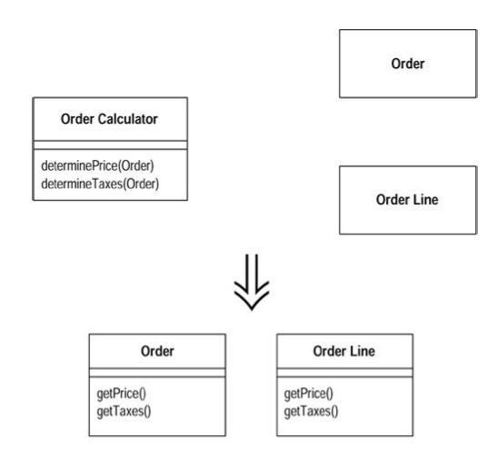

## What

你手上有一些传统过程化风格的代码。

**将数据记录变成对象，将大块的行为分成小块，并将行为移入相关对象之中。**

**将过程化设计转化为对象设计：**

## Why

尽管`Java`是面向对象语言，"使用对象"可远不仅仅是调用构造函数而已。

## When
典型的情况是：类中有着长长的过程化函数和极少的数据，旁边则是一堆哑数据对象（除了数据访问函数外没有其他任何函数）。

## How

1. 针对每一个记录类型，将其转变为只含访问函数的哑数据对象。

    > 如果你的数据来自关系式数据库，就把数据库中的每个表变成一个哑数据对象。
    
2. 针对每一处过程化风格，将该处的代码提炼到一个独立类中。

    > 你可以把提炼所得的类做成一个`Singleton`（为了方便重新初始化），或是把提炼所得的函数声明为`static`。
    
3. 针对每一段长长的程序，实施[Extract Method](../composing-methods/extract-method.md)及其他相关重构将它分解。再以[Move Method](../moving-features-between-objects/move-method.md)将分解后的函数分别移到它所相关的哑数据类中。

4. 重复上述步骤，直到原始类中的所有函数都被移除。