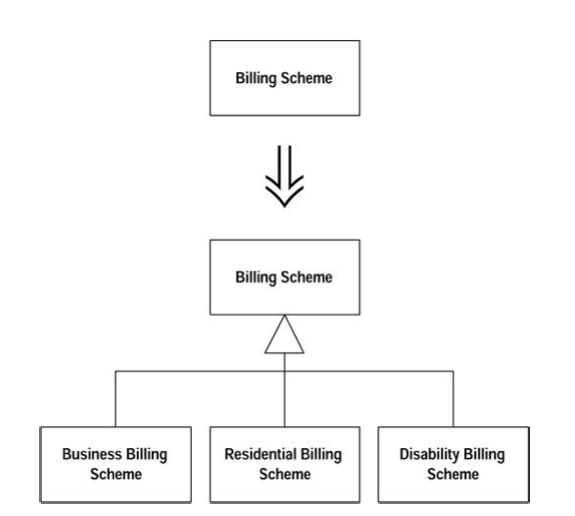

## What

你有某个类做了太多工作，其中一部分工作是以大量条件表达式完成的。

**建立继承体系，以一个子类表示一种特殊情况。**

**提炼继承体系：**

## Why

在渐进式设计过程中，常常会有这样的情况：一开始设计者只想以一个类实现一个概念；但随着设计方案的演化，最后却可能一个类实现了两个、三信及至十个不同的概念。
一开始，你建立了这个简单的类。数天或数周之后，你可能发现：只要加入一个标记和一两个测试，就可以在另一个环境下使用这个类；
一个月之后你又发现了另一个这样的机会；一年之后，这个类就完全一团糟了：**标记变量和条件表达式遍布各处。**

## How

两组重构做法:

* 第一种情况是：你无法确定哪些地方会发生变化。这时候你会希望每次一小步地前进。

    1. 鉴别出一种变化情况。

        * 如果这种变化可能在对象生命周期的不同阶段而有不同体现，就运用[Extract Class](../moving-features-between-objects/extract-class.html)将它提炼成一个独立的类。
        
    2. 针对这种变化情况，新建一个子类 ，并对原始类实施[Replace Constructor with Factory Method](../making-method-calls-simpler/replace-constructor-with-factory-method.html)。再修改工厂函数，令它返回适当的子类实例。

    3. 将含有条件逻辑的函数，一次一个，逐一复制到子类，然后在明确情况下（对子类明确，对超类不明确），简化这些函数。

        * 如有必要隔离函数中的条件逻辑和非条件逻辑，可对超类实施[Extract Method](../composing-methods/extract-method.html)。
        
    4. 重复一述过程，将所有变化情况都分离出来，直到可以将超类声明为抽象类为止。

    5. 删除超类中那些被所有子类覆写的函数本体，并将它们声明为抽象函数。

        * 如果你非常清楚原始类会有哪些变化情况，可以使用另一种做法。

    1. 针对原始类的每一种变化情况，建立一个子类。

    2. 使用[Replace Constructor with Factory Method](../making-method-calls-simpler/replace-constructor-with-factory-method.html)将原始类的构造函数转弯成工厂函数，并令它针对每一种变化情况返回适当的子类实例。

        * 如果原始类中的各种变化情况是以类型码标示，先使用[Replace Type Code with Subclasses](../organizing-data/replace-type-code-with-subclasses.html)；
        * 如果那些变化情况在对象生命周期的不同阶段会有不同体现，请使用[Replace Type Code with State/Strategy](../organizing-data/replace-type-code-with-state-or-strategy.html)。
    
3. 针对带有条件逻辑的函数，实施[Replace Conditional with Polymorphism](../simplifying-data/replace-conditional-with-polymorphism.html)。如果并非整个函数的行为有所变化，而只是函数一部分有所变化，请先运用[Extract Method](../composing-methods/extract-method.html)将变化部分和不变化部分隔开来。