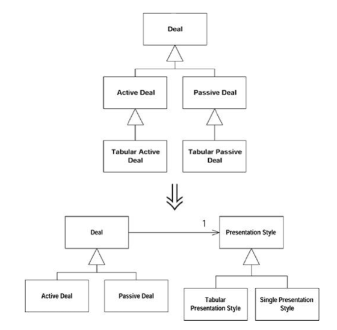

## What

某个继承体系同时承担两项责任。

**建立两个继承体系，并通过委托关系让其中一个可以调用另一个。**

## Why
* 经常为了一项小任务而加入一个小小的子类，使得继承体系承担的责任越来越多，混乱的继承体系是一个严重的问题，会导致代码重复。

## When
* 继承体系承担了两项不同的责任。

## How
1. 首先识别出继承体系所承担的不同责任，然后建立一个二维表格，并以坐标轴标示出不同的任务。将重复运用本重构，处理两个或两个以上的维度。

2. 判断哪一项责任更重要些，并准备将它留在当前的继承体系中。准备将另一项责任移到另一个继承体系中。

3. 使用Extract Class从当前的超类中提炼出一个新类，用以表示重要性稍低的责任，并在原超类中添加一个实例变量，用以保存新类的实例。

4. 对应于原继承体系中的每个子类，创建上述新类的一个子类。在原继承体系的子类中，将前一步骤所添加的实例变量初始化为新建的子类实例。

5. 针对原继承体系中的每个子类，使用Move Method将其中的行为搬移到与之对应的新建子类中。

6. 当原继承体系中的某个子类不再有任何代码时，就将它去除。

7. 重复上述步骤，直到原继承体系中的所有子类都被处理过为止。观察新继承体系，看看是否有可能对它实施其他重构手法，例如Pull Up Method或Pull Up Field。

