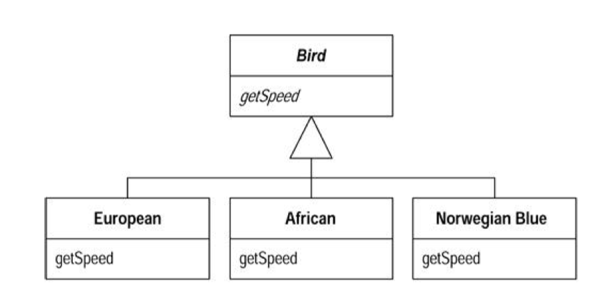

## What

你手上有个条件表达式，它根据对象类型的不同而选择不同的行为。

**将这个条件表达式的每个分支放进一个子类 内的覆写函数中，然后将原始函数声明为抽象函数**


**原始代码：**

```java
double getSpeed(){
    switch(type){
        case EUROPEAN:
            return getBaseSpeed();
        case AFRICAN:
            return getBaseSpeed() - getLoadFactor() * numberOfCocounts;
        case NORWEGIN_BLUE:
            return isNailed ? 0 : getBaseSeppd(voltage);
    }
    throw new RuntimeException("should bu unreachable");
}
```

**以多态取代条件表达式：**

