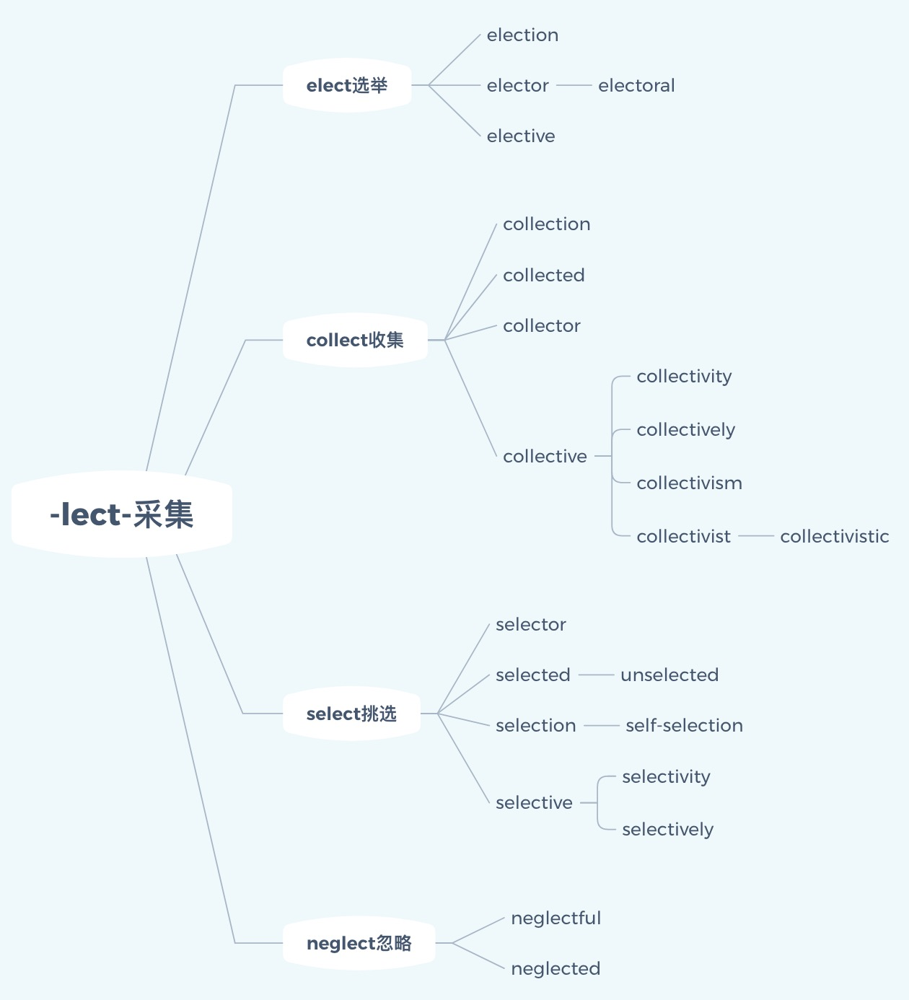
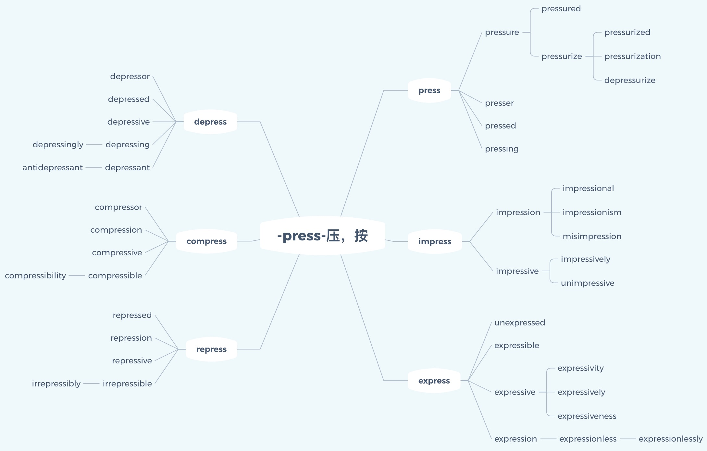

## 词汇速记

### 1. -lect- 采集

【词源】

 > ① 都来源于拉丁语legere选/挑，前者是此词的动名词词干，中间是此词的不定式词干，后者是-leg-在添加某些前缀时的音变形式；其中，前者的派生词最多。

 > ② 词根-lect-来源：拉丁语legere的过去分词lectus。

 > ③ 词根-lig-来源于：拉丁语原先的词根变化。
 
 > ④ 来源于拉丁语legalis/lex法律。


【引申】

 > 收/选择/收集/集合/阅读/读/说/演说/辩论/法律/法制


【前缀】

```
e- 向外                                            col- 在一起
un- 否定                                           se- 分
self- 自己                                         neg- 否定
```

【后缀】
```
-or 名词或形容词后缀                                 -ic 形容词或名词后缀
-ion 名词后缀                                      -ism 名词后缀，表、、、主义
-ive 形容词后缀                                     -ity 名词后缀
-ed 形容词或过去式或过去分词                          -ly 副词后缀
-al 形容词或名词后缀                                 -ful 形容词后缀
-ist 形容词或名词后缀
```

`elect` [ɪ'lekt] 
- adj. 选出的；当选的；卓越的 
- n. 被选的人；特殊阶层；上帝的选民 
- vt. 选举；选择；推选
- vi. 作出选择；进行选举

`election` [i'lekʃən] 
- n. 选举
`elector` [i'lektə] 
- n. 选举者，有选举权的人
`electoral` [ɪ'lekt(ə)r(ə)l] 
- adj. 选举的；选举人的
`elective` [ɪ'lektɪv] 
- adj. 选修的；选举的；选任的 
- n. 选修课程

`collect` [kə'lekt] 
- vt. 收集；募捐 
- vi. 收集；聚集；募捐 
- adv. 由收件人付款地 
- adj. 由收件人付款的

`collection` [kə'lekʃ(ə)n] 
- n. 采集，聚集；[税收] 征收；收藏品；募捐

`collected` [kə'lektɪd] 
- adj. 镇定的；收集成的

`collector` [kə'lektə] 
- n. 收藏家；[电子] 集电极；收税员；征收者

`collective` [kə'lektiv] 
- adj. 集体的；共同的；集合的；集体主义的 
- n. 集团；集合体；集合名词

`collectivity` [,kɒlek'tɪvɪtɪ] 
- n. 集体；集体主义

`collectively` [kə'lektivli] 
- adv. 共同地，全体地

`collectivism` [kə'lektivizəm] 
- n. 集体主义

`collectivist` [kə'lɛktɪvɪst] 
- n. 集体主义者 
- adj. 集体主义的

`collectivistic` [kə,lekti'vistik] 
- adj. 集体主义的

`select` [sɪ'lekt] 
- vt. 挑选；选拔 
- adj. 精选的；挑选出来的；极好的 
- vi. 挑选 
- n. 被挑选者；精萃

`selector` [sɪ'lektə] 
- n. 选择器；挑选者

`selected` [sɪ'lektɪd] 
- adj. 挑选出来的

`unselected` [ʌnsi'lektid] 
- adj. 未经选择的

`selection` [si'lekʃən] 
- n. 选择，选择物，选集，选品

`self-selection` [,selfsi'lekʃən] 
- n. 自己挑选

`selective` [sɪ'lektɪv] 
- adj. 选择性的；讲究的

`selectivity` [sɪlek'tɪvɪtɪ] 
- n. 选择性；分离性；选择度

`selectively` [sə'lɛktɪvli] 
- adv. 有选择地

`neglect` [nɪ'glekt] 
- vt. 疏忽，忽视；忽略 
- n. 疏忽，忽视；怠慢

`neglectful` [ni'ɡlektful] 
- adj. 疏忽的；忽略的；不小心的

`neglected` [nɪˈglektɪd] 
- adj. 被忽视的


【思维导图】


           


### 2. -press- 压，按

【词源】

 > 来自拉丁语pressare，按，压，来自premere，按，压，-ss，过去分词格或表反复，来自PIE*per，击，打，捶，词源同print.由按，压引申词义印刷，报纸等相关词义。


【引申】

 > 压/按/印刷/压迫/压制


【前缀】
```
over- 在上，超过                                                         anti- 反
de- 向下，分离                                                           com- 在一起，强调
im- 否定，使动，强调                                                      re- 往回，重复，再次
ex- 向外                                                                i??- 否定（？代指两个相同的辅音字母）                      
un- 否定
```


【后缀】
 
 ```
-er = -or 名词或形容词后缀                                               -ion 名词后缀
-ed 形容词或过去式或过去分词                                              -al 形容词或名词后缀
-ing 形容词或动名词或现在分词                                             -ism 名词后缀，表、、、主义
-ure 名词或动词后缀                                                     -ible 形容词后缀，表能、、、的
-ize 动词后缀，表使动                                                   -ity 名词后缀
-ation 复合名词后缀                                                    -ness 名词后缀
-ive 形容词或名词后缀                                                   -less 形容词后缀，表否定
-ly 副词后缀                                                           -ant  形容词或名词后缀

```


`press` [pres] 

- vt. 压；按；逼迫；紧抱 
- vi. 压；逼；重压 
- n. 压；按 [印刷] 印刷机


`presser` ['presə] 
- n. 压榨机；压制工


`pressed` [prɛst] 
- adj. 加压的；紧迫的


`pressing` ['presɪŋ] 
- n. 压；冲压件 
- adj. 紧迫的；迫切的；恳切的


`pressure` ['preʃə] 
- n. 压力；压迫，[物] 压强 
- vt. 迫使；密封；使……增压【


`pressured` ['preʃəd] 
- adj. 紧迫的；感受压力的


`pressurize` ['preʃəraɪz] 
- vt. 密封；增压；使……加压，使……压入


`pressurized` ['prɛʃəraɪzd] 
- adj. 加压的；受压的


`pressurization` [ˌpreʃərɪˈzeɪʃn;] 
- n. 增压；气密；压力输送


`depressurize` [diː'preʃəraɪz] 
- vt. 使减压


`impress` [ɪm'pres] 
- vt. 盖印；强征；传送；给予某人深刻印象 
- vi. 给人印象 
- n. 印象，印记；特征，痕迹


`impression` [ɪm'preʃ(ə)n] 
- n. 印象


`impressional` [ɪm'prɛʃənl] 
- adj. 印象的；易受影响的


`impressionism` [ɪm'preʃənɪzəm] 
- n. 印象派，印象主义


`misimpression` [,misim'preʃən] 
- n. 错误的印象


`impressive` [ɪm'presɪv] 
- adj. 给人印象深刻的


`impressively` [im'presivli] 
- adv. 令人难忘地；感人地


`unimpressive` ['ʌnɪm'prɛsɪv]
-  adj. 无印象的；给人印象不深的；不惹人注意的


`express` [ɪk'spres] 
- vt. 表达；快递 
- adj. 明确的；迅速的；专门的 
- adv. 清楚地，明显地；特别地，专门地 
- n. 快车，快递，专使；捷运公司

`unexpressed` [ʌnɪk'sprest] 
- adj. 未表达的；不明说的


`expressible` [ɪk'sprɛsəbl] 
- adj. 可表现的；可榨出的


`expressive` [ɪk'spresɪv] 
- adj. 表现的；有表现力的；表达…的


`expressivity` [,ekspre'sɪvətɪ] 
- n. 表达性；善于表达；基因的表现度


`expressively` [ɪk'sprɛsɪvli] 
- adv. 表现地；意味深长地；表示地


`expressiveness` [ɪk'sprɛsɪvnɪs] 
- n. 善于表现；表情丰富


`expression` [ɪkˈspreʃn] 
- n. 表现；表达


`expressionless` [ɪk'spreʃ(ə)nlɪs] 
- adj. 无表情的；呆板的


`expressionlessly` [ɪk'spreʃ(ə)nlɪsli] 
- adv. 无表情地；呆板地


`depress` [dɪ'pres] 
- v. 使沮丧，使意志消沉，使心灰意冷


`depressor` [dɪ'presə] 
- n. 抑压者；抑压物


`depressed` [dɪ'prest] 
- adj. 沮丧的；萧条的；压低的


`depressive` [dɪ'presɪv] 
- adj. 抑郁的；压抑的


`depressing` [dɪ'presɪŋ] 
- ad.j令人沮丧的；令人抑郁的


`depressingly` [dɪ'prɛsɪŋli] 
- adv. 郁闷地；抑压地


`depressant` [dɪ'pres(ə)nt] 
- n. 镇静剂，[医][矿业] 抑制剂 
- adj. 有镇静作用的


`antidepressant` [,æntɪdɪ'pres(ə)nt] 
- n. 抗抑郁剂 adj. 抗抑郁的


`compress` [kəm'pres] 
- vt. 压缩，压紧


`compressor` [kəm'presə] 
- n. 压缩机；压缩物


`compression` [kəm'preʃ(ə)n] 
- n. 压缩，浓缩


`compressive` [kəm'presɪv] 
- adj. 压缩的；有压缩力的


`compressible` [kəm'prɛsəbl] 
- adj. 可压缩的；可压榨的


`compressibility` [kəm,prɛsə'bɪləti] 
- n. 压缩性；压缩系数；压缩率


`repress` [rɪ'pres] 
- vt. 抑制；镇压


`repressed` [rɪ'prest] 
- adj. 被压抑的；被抑制的


`repression` [rɪ'preʃən] 
- n. 抑制，[心理] 压抑


`repressive` [rɪ'presɪv] 
- adj. 镇压的；压抑的；抑制的


`irrepressible` [ɪrɪ'presɪb(ə)l] 
- adj. 抑制不住的；压服不了的


`irrepressibly` [ɪrɪ'prɛsəbli] 
- adv. 镇压不住地；无法抑制地


【思维导图】





